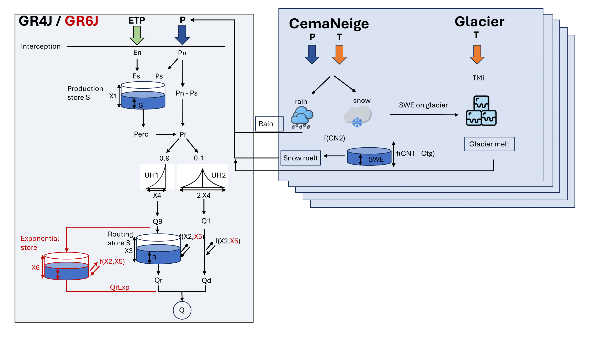

# airGR_GM

GRXJ + CemaNeige + Glacier Model

## Summary

This package is a modification based on the [airGR package version
1.7.6](https://cran.r-project.org/package=airGR), developed to include
glacier ablation in addition to the existing suite of conceptual
rainfall-runoff models. The original airGR package, developed by
INRAE-Antony (HYCAR Research Unit, France), includes models like GR4H,
GR5H, GR4J, GR5J, GR6J, GR2M, GR1A, and the snow accumulation and melt
model (CemaNeige).

This modification includes mainly two changes: 1. The introduction of a
glacier module 2. The ability to adjust the temperature and
precipitation lapse rates.

### 1. Glacier Module

This modification adds two main functions:
RunModel_CemaNeigeGR4J_Glacier and RunModel_CemaNeigeGR6J_Glacier. They
are built upon the functions RunModel_CemaNeigeGR4J and
RunModel_CemaNeigeGR6J from the original airGR package. The package
works in combination with the modified [airGRdatassim
package](https://github.com/hydrosolutions/airgrdatassim), which also
allows these adjusted conceptual models to run with data assimilation.



In this development, a glacier module is added.

SWE is modeled within the CemaNeige compartment and provided as input to
the glacier module. Ice melt occurs only when both temperature and SWE
thresholds are exceeded, and is modeled using the equation below:

$$
M_i = \begin{cases} 
F_i \times (T - T_m) \times A_i & \text{if } SWE \geq SWE_{th} \text{ and } T \geq T_m \\
0 & \text{if } SWE < SWE_{th} \text{ or } T < T_m 
\end{cases}
$$

Where:

-   $M_i$ is the daily ice melt from glaciers [mm/day].
-   $F_i$ is the ice melting factor $[mm/°C/day]$.
-   $T$ is the daily temperature $[°C]$.
-   $T_m$ is the ice melting threshold temperature $[°C]$.
-   $A_i$ is the area of the glacier ice that contributes to melting.
-   $SWE$ is the Snow Water Equivalent [mm].
-   $SWE_{th}$ is the threshold amount of SWE on the glacier before ice
    melt occurs $[mm]$.

$M_i$, $F_i$, and $SWE_{th}$ are three new calibration factors. Glacier
melt in the elevation layers is given as liquid input into the GR4J
model in the same way than in the CemaNeige layer with the snow melt.

The modification for the glacier module includes new functions and
changes to existing functions, such as:

-   `RunModel_CemaNeigeGR4J_Glacier.R`: New function that runs the
    CemaNeigeGR4J model with the glacier module.

-   `RunModel_CemaNeigeGR6J_Glacier.R`: New function that runs the
    CemaNeigeGR6J model with the glacier module.

-   `TransfoParam_Glacier.R`: New function that transforms the three
    additional glacier parameters for calibration.

-   `CreateRunOptions.R`: Include the relative ice area in the run
    options. Add RunModel_CemaNeigeGR4J_Glacier,
    RunModel_CemaNeigeGR6J_Glacier

-   `CreateCalibOptions.R`: Include default parameter distributions for
    the glacier module.

-   `Utils.R`: Get the correct name also with the glacier module.

-   `UtilsCalibOptions.R`: Include the glacier module for the
    calibration.

-   `UtilsRunModel.R`: Include SWE in the Output of the model needed in
    the glacier module.

-   `RunModel.R`: Minor changes regarding parameter

## Installation

### Prerequisites

Before installing airGR_GM, ensure you have the following prerequisites
installed on your system:

R: Version 4.1.1 or higher RTools (Windows only): Required for building
packages from source Homebrew (macOS only): A package manager for macOS
Fortran Compiler: gfortran must be installed and properly linked The
package requires R version \>= 4.1.1

**Note** that **Windows** users require a working installation of \<a
href="<https://cran.r-project.org/bin/windows/Rtools/>"

### 1. Install Homebrew (macOS only)

If you're on macOS, install Homebrew by running the following command in
your terminal:

``` r
/bin/bash -c "$(curl -fsSL https://raw.githubusercontent.com/Homebrew/install/HEAD/install.sh)"
```

### 2. Install the Fortran Compiler (gfortran)

macOS: Open your terminal and run the following commands:

#### 2.1  Install gcc which includes gfortran using Homebrew:

``` r
brew install gcc
```
You can check the installation by running:

``` r
gfortran --version
```
and find the path where gfortran is installed by running:


#### 2.2 Set up the Makevars file for R to find the C and Fortran libraries:

1 Find the Path for the Fortran Compiler (gfortran):
``` r
which gfortran
```
This should return something like:
``` r
/opt/homebrew/bin/gfortran
```
2 Find the Path for the Fortran Libraries:

First, identify the specific version of GCC installed by running:
``` r
brew --prefix gcc
```
Then, use the following command to get the path to the Fortran libraries
``` r
echo $(brew --prefix gcc)/lib/gcc/$(gcc-14 -dumpversion)
```
This should return a path similar to:
``` r
/opt/homebrew/Cellar/gcc/14.1.0/lib/gcc/14/
````
3 Create a Makevars file in your R directory:

``` r
nano ~/.R/Makevars
```

Add the following lines to your Makevars file to ensure R finds the necessary compilers and libraries (The following are exmaple paths)

``` r
FC = /opt/homebrew/Cellar/gcc/14.1.0/bin/gfortran
F77 = /opt/homebrew/Cellar/gcc/14.1.0/bin/gfortran
FLIBS = -L/opt/homebrew/Cellar/gcc/14.1.0/lib/gcc/14/ -lgfortran -lquadmath -lm
```

Save the file. 

### 3. Install airGR_GM

With all dependencies installed, you can now install the airGR_GM package using the devtools package in R. First, ensure that devtools is installed:


``` r
# install.packages("devtools")
devtools::install_github("hydrosolutions/airGR_GM")
```


